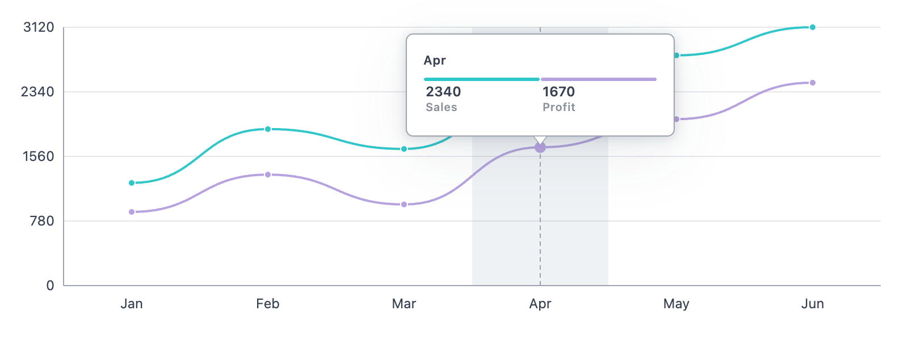

# Orchid Charts

> Lightweight PHP-first SVG charting library with zero JavaScript output

Orchid Charts is a server-side charting library that generates clean, accessible SVG charts directly in PHP — no JS, no
hydration, no runtime dependencies.



## Installation

```bash
composer require orchid/charts
```

## Quick start

```php
use Orchid\Charts\Charts\LineChart;

$chart = LineChart::make()
    ->labels(['Jan', 'Feb', 'Mar', 'Apr', 'May', 'Jun'])
    ->dataset('Sales', [1240, 1890, 1650, 2340, 2780, 3120])
    ->dataset('Profit', [890, 1340, 980, 1670, 2010, 2450]);

echo $chart; // or $chart->render()
```

All chart objects are `Stringable`, so you can render with `echo $chart`.

### Bar

```php
use Orchid\Charts\Charts\BarChart;

echo BarChart::make()
    ->labels(['Mon', 'Tue', 'Wed'])
    ->dataset('Revenue', [90, 140, 110]);
```

### Pie

```php
use Orchid\Charts\Charts\PieChart;

echo PieChart::make()
    ->labels(['Desktop', 'Mobile', 'Tablet'])
    ->dataset('Traffic', [58, 35, 7]);
```

### Donut

```php
use Orchid\Charts\Charts\DonutChart;

echo DonutChart::make()
    ->labels(['Direct', 'Search', 'Referral'])
    ->dataset('Channels', [45, 40, 15]);
```

### Percentage

```php
use Orchid\Charts\Charts\PercentageChart;

echo PercentageChart::make()
    ->labels(['Done', 'In progress', 'Backlog'])
    ->dataset('Sprint', [55, 30, 15]);
```


## Dataset formatter (tooltip value)

Use callback as the 3rd parameter:

```php
use Orchid\Charts\Charts\LineChart;

echo LineChart::make()
    ->labels(['Jan', 'Feb'])
    ->dataset('Visitors', [172, 181], static fn (int|float $value): string => $value.' visits');
```

Or pass both color and formatter:

```php
->dataset(
    'Visitors',
    [172, 181],
    '#2563eb',
    static fn (int|float $value): string => $value.' visits'
    );
)
```

## Support

If this project helps you build faster dashboards or removes frontend complexity, consider giving it a star — it helps
the project grow and stay maintained.
