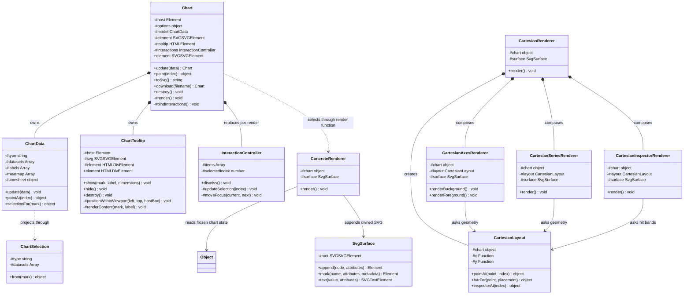

# Architecture

Charts2 is an integrated, dependency-free SVG library. It uses classes where
identity, state, lifecycle, or polymorphic behavior exists, and pure functions
for stateless normalization, layout, formatting, and geometry. Directories are
boundaries, not buckets.

The package boundary is equally explicit: `src/index.js` and `src/index.d.ts`
define the public contract, Vite produces a module-preserving ESM build, and the
`files` allowlist in `package.json` decides what leaves the repository. Tests,
demo sources, coverage, credentials, and local tooling are never part of the
published archive.

The demo and laboratory have separate jobs. The primary showroom explains chart
families through recognizable product questions. `demo/lab.html` groups all
product and edge-case fixtures by renderer for QA, responsive inspection, and
regression tests. Both pages use the same `Main.js` fixture definitions and the
public named chart definitions; no demo-only renderer or private hook exists.

## Source map

```text
src
├─ index.js                         # Frozen named chart definitions
├─ index.d.ts                       # Type-specific fluent public contract
├─ styles.css                       # Public visual and interaction states
├─ core
│  ├─ ChartDefinition.js            # Immutable make(parent) entry
│  ├─ Builder.js                    # Detached fluent authoring and scene compilation
│  ├─ BuilderScopes.js              # One callback-scope lifecycle and domain builders
│  ├─ Chart.js                      # Mounted façade; private DOM lifecycle
│  ├─ Options.js                    # Validation and renderer-ready defaults
│  ├─ ChartData.js                  # Family-normalized model snapshots
│  ├─ ChartSelection.js             # Public selection payload policy
│  ├─ ChartTooltip.js               # Safe content and viewport placement
│  ├─ InteractionController.js      # Pointer, focus, keyboard, selection state
├─ renderers
│  ├─ Render.js                     # Shared surface boundary
│  ├─ SvgSurface.js                 # Narrow owned SVG mutation boundary
│  ├─ CartesianRenderer.js          # Cartesian rendering coordinator
│  ├─ CartesianLayout.js            # Scales, bars, points, and hit bands
│  ├─ CartesianAxesRenderer.js      # Grid, axes, labels, and markers
│  ├─ CartesianSeriesRenderer.js    # Line, area, point, scatter, and bar layers
│  ├─ CartesianInspectorRenderer.js # Category hit targets and tooltip rows
│  ├─ AggregationRenderer.js        # Pie, donut, percentage DOM presentation
│  ├─ Composition.js                # Part-to-whole policy and sector geometry
│  ├─ RadarRenderer.js              # Comparable radial datasets
│  ├─ PolarAreaRenderer.js          # Radius-encoded polar sectors
│  ├─ HeatmapRenderer.js            # Calendar heatmap
│  ├─ TimesheetRenderer.js          # Time-range DOM presentation
│  ├─ TimesheetLayout.js            # Temporal scale, rows, bars, and ticks
│  └─ LegendRenderer.js             # Shared series and item legends
└─ support
   ├─ Normalize.js                  # Pure validation and normalization rules
   ├─ Math.js                       # Stable public facade for mathematical helpers
   ├─ Scale.js                      # Numeric extents, interpolation, and nice ticks
   ├─ CartesianGeometry.js          # Line and rounded-bar path geometry
   ├─ SectorGeometry.js             # Polar points, sectors, rings, and padding
   ├─ Presentation.js               # Label, legend, and layout calculations
   ├─ Constants.js                  # Frozen enums and immutable design values
   ├─ Dom.js                        # Small SVG, text, and host primitives
   └─ Time.js                       # Time ticks and display formatting
```

## Class relationships



`ConcreteRenderer` denotes the chart-family renderer classes. They do not
inherit from a base class because JavaScript has no native `protected` scope and
there is no shared stateful algorithm worth forcing into inheritance. They share
one frozen plain-object chart state plus a narrow `SvgSurface`; a getter-only
DTO class added no behavior.

`CartesianRenderer` remains the stateful Cartesian coordinator. Its definition
supplies family-specific layout and series functions; no global registry or
runtime lookup exists. Axes and inspector collaborators remain cohesive
implementation classes rather than public extension points.
`CartesianLayout`, `TimesheetLayout`, and `Composition` are behavioral objects:
they answer domain questions and keep calculated geometry out of DOM code.

## Dependency direction

```text
index → ChartDefinition → Builder → detached scene → bound mount
          ↘ implementation → Chart → ChartData → support
                                  ↘ Render → frozen chart state + SvgSurface → bound renderer
                                           ↘ InteractionController

concrete renderers → support
```

- `ChartDefinition` is the composition root. It binds immutable type identity,
  one model factory, one renderer function, and `make(parent)`.
  Builders own authoring state and compile it without reading or mutating DOM.
- Pure support calculations (`Normalize`, `Math`, and `Presentation`) never
  import `core`, a renderer, or browser globals.
- `ChartData` owns normalization state and knows nothing about tooltips, SVG
  layout, or listeners. Public payload construction belongs to the
  snapshot-bound `ChartSelection` presenter.
- `Chart` is the only lifecycle root for hosts, global listeners, resize, and
  destruction. Its owned `ChartTooltip` collaborator owns safe tooltip content
  and viewport placement.
- `renderChart` validates the bound renderer function before reading state, then
  supplies frozen chart state and one `SvgSurface`. There is no registry.
- Concrete renderers receive frozen chart state and one `SvgSurface`. The chart
  state contains no DOM node; the surface exposes only deliberate append, mark,
  text, root-attribute, and root-style operations.
- `InteractionController` lives beside its lifecycle owner in `core`, owns the
  roving tab stop and transient/persistent interaction state; `Chart` only
  translates its callbacks into public events.

## Visibility policy

The [ECMAScript 2026 class specification](https://tc39.es/ecma262/2026/multipage/ecmascript-language-functions-and-classes.html)
defines native private identifiers for class fields, methods, and accessors.
JavaScript has `public` and native `#private` class elements, but no native
`protected` visibility. Charts2 therefore uses these rules:

1. Package-public values are the twelve frozen chart definitions and the
   returned TypeScript `Chart` interface. There is no generic runtime factory.
2. Each definition exposes only `make(parent)`; each type-specific builder
   exposes only its valid domain methods and `render()`.
3. Mounted `Chart` exposes only `element`, `update`, `point`, `toSvg`, `download`,
   and `destroy`.
4. Every mutable property and lifecycle helper is a native `#private` element;
   underscore conventions are not accepted as encapsulation.
5. Internal class collaboration uses constructor injection and frozen chart state,
   not public mutation, `.call(this)`, or pseudo-protected properties.
6. Renderer helper methods are `#private`. A method is public only when another
   internal class deliberately collaborates with it, such as legend item layout.
7. Stateless algebra remains a named function. Utility classes containing only
   static functions are prohibited because they add ceremony without ownership.

## Public boundary

```js
import { LineChart } from "@charts2/core";

const chart = LineChart.make("#revenue")
  .dataset([12, 18, 16])
  .colors(["#00bdff", "#1b3bff"])
  .height(300)
  .gradient()
  .render();

chart.update({ datasets: [{ values: [14, 21, 19] }] });
chart.point(0);
chart.toSvg();
chart.download("revenue");
chart.destroy();
```

There is no generic factory, public constructor hierarchy, default export,
mutable `options`, `svg` alias, renderer method, plugin hook, or compatibility
adapter.

## Non-negotiable invariants

1. A host owns at most one chart SVG and one tooltip.
2. A chart owns one resize path and one document-level dismissal listener.
3. All input is normalized by `ChartData` before a renderer sees it.
4. A missing renderer implementation fails before chart state is read.
5. Every interactive mark uses `InteractionController`.
6. `toSvg()` is pure; the side-effecting download is named `download()`.
7. New chart types bind one existing family model/render path in a frozen
   definition; they do not add another lifecycle or public constructor.
8. No compatibility adapter may be added without an explicit removal release.
9. Stateful classes use native `#private` ownership and explanatory JSDoc.
10. Architecture fitness tests enforce dependency direction, class form, private
    ownership, package exports, and removed compatibility paths.
11. Production functions and methods carry multiline explanatory JSDoc with
    parameter and return descriptions; ESLint rejects incomplete contracts.
12. Closed domain vocabularies use frozen enum objects; exported palettes,
    memberships, and scale steps are frozen arrays rather than mutable sets.
13. A class must own identity, mutable state, or cohesive polymorphic behavior;
    stateless transformation, dispatch, and DTO boundaries remain functions or
    frozen plain objects.
14. Application method names do not begin with Java-style `get` or `set`;
    property accessors use nouns and commands describe their domain effect.
15. Production modules live only in `core`, `renderers`, or `support`; a new
    top-level source directory requires several cohesive modules and an explicit
    dependency rule, not merely a new technical noun.
16. Prettier owns JavaScript, CSS, HTML, and Markdown formatting; ESLint owns
    JavaScript quality, while Stylelint owns CSS correctness, kebab-case
    selectors, and logical property order. Stylesheets use comments to mark
    cohesive visual sections.
17. Internal object parameters expose at most four cohesive fields. Wider
    contracts become named value/layout objects or are split by responsibility;
    large anonymous return records and private-method object bags are rejected
    by ESLint.
18. Builders never import renderers or browser primitives, never resolve the
    parent before `render()`, and are consumed only after a successful commit.
19. Chart-wide conventions are expressed once on the chart builder; dataset
    scopes only override them locally.

The opinion matrix, rejected alternatives, and implementation record are in
[REFACTORING.md](./REFACTORING.md). The per-module vocabulary decisions are in
[NAMING.md](./NAMING.md).
