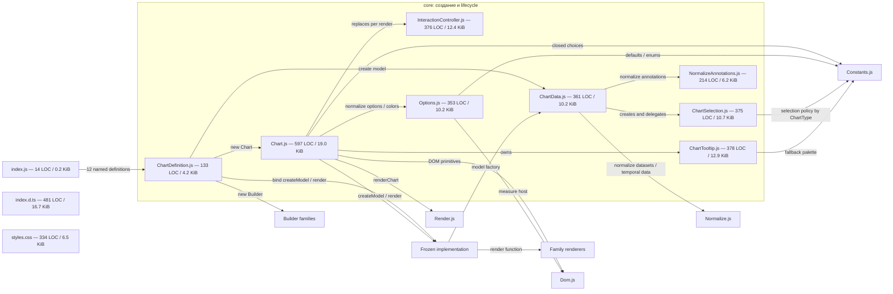
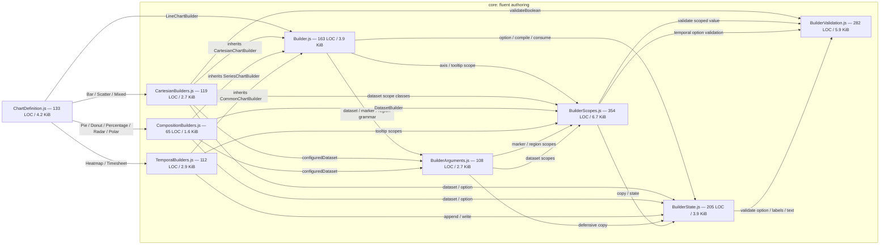
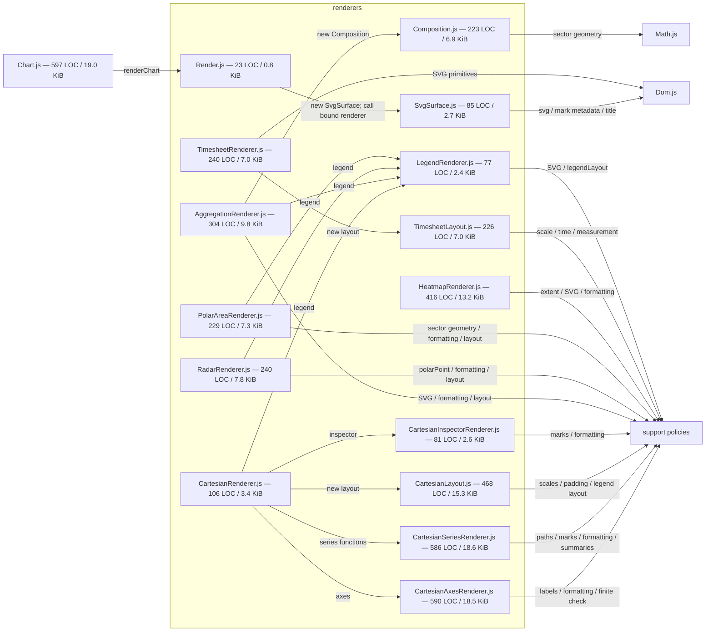
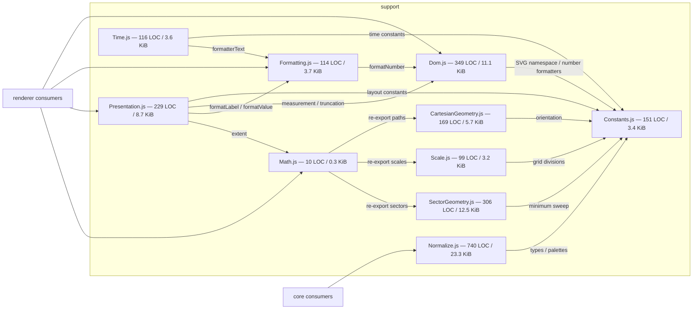

# Карта кода и аудит упрощения

This document records earlier review decisions and measurements. For the current
module structure and matrix implementation, see [ARCHITECTURE.md](./ARCHITECTURE.md)
and [MATRIX_IMPLEMENTATION.md](./MATRIX_IMPLEMENTATION.md).

Снимок обновлён по текущему рабочему дереву 29 августа 2026 года. В карту
включён production-контур `src/`: 44 текстовых файла, 12 014 строк и 377 726
байт. Удалённый в рабочем дереве `core/NextChartId.js` не включён. PNG-снапшоты,
тесты, demo и tooling показаны только агрегатами: они не участвуют в runtime
графе.

Обозначение ребра `A -->|x| B`: файл A импортирует и вызывает/использует `x` из
файла B. Размер в узле — физические строки и KiB исходника, до минификации.

## Карта файлов и вызовов

### Публичная граница и создание chart

`index.d.ts` и `styles.css` — параллельные публичные контракты, а не runtime
imports: TypeScript проверяет fluent grammar, CSS оформляет созданные SVG/HTML
узлы.

### Fluent authoring

### Rendering

`ChartDefinition.js` вызывает family entry functions:
`renderAggregationChart`, `renderLineChart`, `renderBarChart`,
`renderPointChart`, `renderMixedChart`, `renderRadarChart`,
`renderPolarAreaChart`, `renderHeatmapChart` и `renderTimesheetChart`.

### Stateless support

Входящая связность подтверждает роль фасадов: `Constants.js` имеет 21
потребителя, `Dom.js` — 15, `Formatting.js` — 9, `Math.js` — 8,
`BuilderState.js` — 6. Циклов между файлами нет; направление
`core/renderers -> support` соблюдается.

## Карта классов

```mermaid
classDiagram
  class CommonChartBuilder
  class SeriesChartBuilder
  class CartesianChartBuilder
  class LineChartBuilder
  class BarChartBuilder
  class ScatterChartBuilder
  class MixedChartBuilder
  class NumericSeriesBuilder
  class SectorChartBuilder
  class PercentageChartBuilder
  class PolarAreaChartBuilder
  class RadarChartBuilder
  class RangedChartBuilder
  class HeatmapChartBuilder
  class TimesheetChartBuilder

  CommonChartBuilder <|-- SeriesChartBuilder
  SeriesChartBuilder <|-- CartesianChartBuilder
  CartesianChartBuilder <|-- LineChartBuilder
  CartesianChartBuilder <|-- BarChartBuilder
  CartesianChartBuilder <|-- ScatterChartBuilder
  CartesianChartBuilder <|-- MixedChartBuilder
  SeriesChartBuilder <|-- NumericSeriesBuilder
  NumericSeriesBuilder <|-- SectorChartBuilder
  NumericSeriesBuilder <|-- PercentageChartBuilder
  NumericSeriesBuilder <|-- PolarAreaChartBuilder
  NumericSeriesBuilder <|-- RadarChartBuilder
  CommonChartBuilder <|-- RangedChartBuilder
  RangedChartBuilder <|-- HeatmapChartBuilder
  RangedChartBuilder <|-- TimesheetChartBuilder

  class DatasetBuilder
  class LineDatasetBuilder
  class BarDatasetBuilder
  class SeriesTooltipBuilder
  class AxisBuilder
  class AnnotationBuilder
  class MarkerBuilder
  class RegionBuilder
  class DateTooltipBuilder
  class HeatmapTooltipBuilder
  class TimesheetTooltipBuilder

  DatasetBuilder <|-- LineDatasetBuilder
  DatasetBuilder <|-- BarDatasetBuilder
  AnnotationBuilder <|-- MarkerBuilder
  AnnotationBuilder <|-- RegionBuilder
  DateTooltipBuilder <|-- HeatmapTooltipBuilder
  DateTooltipBuilder <|-- TimesheetTooltipBuilder

  class Chart
  class ChartData
  class ChartSelection
  class ChartTooltip
  class InteractionController
  Chart *-- ChartData : owns snapshot
  ChartData *-- ChartSelection : owns presenter
  Chart *-- ChartTooltip : owns lifecycle
  Chart *-- InteractionController : replaces

  class SvgSurface
  class CartesianRenderer
  class CartesianLayout
  class CartesianAxesRenderer
  class CartesianInspectorRenderer
  class LinePresentation
  class AggregationRenderer
  class Composition
  class RadarRenderer
  class PolarAreaRenderer
  class HeatmapRenderer
  class TimesheetRenderer
  class TimesheetLayout
  class LegendRenderer
  class TimesheetPalette

  Chart ..> SvgSurface : render boundary creates
  CartesianRenderer *-- CartesianLayout
  CartesianRenderer *-- CartesianAxesRenderer
  CartesianRenderer *-- CartesianInspectorRenderer
  CartesianRenderer ..> LinePresentation : series functions create
  AggregationRenderer *-- Composition
  AggregationRenderer ..> LegendRenderer
  RadarRenderer ..> LegendRenderer
  PolarAreaRenderer ..> LegendRenderer
  TimesheetRenderer *-- TimesheetLayout
  ChartData ..> TimesheetPalette : normalization creates
```

Важно: `CartesianSeriesRenderer.js` сейчас не содержит renderer-класса. Это
набор функций и небольшой value object `LinePresentation`. Поэтому превращать
его в класс только ради симметрии с остальными renderer-файлами не следует.

## Размер и концентрация сложности

| Зона        | Файлов |   LOC |    Байт | Наблюдение                                |
| ----------- | -----: | ----: | ------: | ----------------------------------------- |
| `core`      |     16 | 5 008 | 150 664 | Fluent API, lifecycle, model, interaction |
| `renderers` |     15 | 3 894 | 125 941 | Реальная SVG/layout сложность             |
| `support`   |     10 | 2 283 |  77 201 | Pure rules и browser primitives           |
| public root |      3 |   829 |  23 920 | JS entry, declarations, CSS               |

Крупнейшие production-файлы: `Normalize.js` 740 LOC, `Chart.js` 597,
`CartesianAxesRenderer.js` 590, `CartesianSeriesRenderer.js` 586,
`index.d.ts` 481 и `CartesianLayout.js` 468. Это точки внимания, но размер сам
по себе не доказывает нарушение ответственности.

В JS-файлах `core`, `renderers`, `support` около 3 519 строк block/line
comments из 11 185 физических строк, то есть примерно 31,5%. Большая часть —
обязательный JSDoc на private methods и локальных functions.

Вне runtime-контура: `test` — 17 текстовых файлов / 5 190 LOC; `demo` — 6 /
3 720 LOC; `docs` до этого отчёта — 12 / 3 043 LOC; `scripts` — 2 / 385 LOC.
Текущий собранный ESM из `demo/BuildSize.js`: 69 913 raw / 21 256 gzip bytes;
aggregate build: 102 066 raw / 30 180 gzip bytes.

## Интерпретация DHH и Taylor Otwell

Это не приписывание авторам мнения о Orchid Charts, а применение их опубликованных
принципов.

- DHH ставит programmer happiness, convention over configuration, отсутствие
  догмы одного paradigm и integrated systems выше архитектурной чистоты ради
  неё самой. Он прямо допускает, что красивый простой внешний API может иметь
  сложную реализацию, и предупреждает против преждевременного дробления системы.
- Laravel описывает цель как expressive/elegant syntax, даёт предсказуемую
  стартовую структуру, но не навязывает каталоги, и использует явную constructor
  injection для настоящих class dependencies.

Источники: [Rails Doctrine](https://rubyonrails.org/doctrine),
[Conceptual Compression](https://signalvnoise.com/svn3/conceptual-compression-means-beginners-dont-need-to-know-sql-hallelujah/),
[The Majestic Monolith](https://signalvnoise.com/svn3/the-majestic-monolith/),
[Laravel: Meet Laravel](https://laravel.com/framework/docs/12.x),
[Laravel directory structure](https://laravel.com/docs/13.x/structure),
[Laravel service container](https://laravel.com/docs/master/container).

## Что упростить

### 1. Убрать обязательный JSDoc с очевидных private/local функций

Это самый безопасный и самый большой резерв сокращения. Оставить документацию
для public API, exported boundary, сложной математики, browser quirks и
неочевидных invariants. Не документировать механически `@param`, `@returns` и
пересказ имени каждого private helper.

Для этого достаточно ослабить `jsdoc/require-jsdoc` в `eslint.config.js` до
public/exported API. Потенциальное сокращение — ориентировочно 2 000–3 000 LOC
без изменения runtime, типов или поведения. Это буквально делает код более
выразительным вместо параллельного prose-слоя.

### 2. Упростить quality contract до правил, ловящих дефекты

Сохранить cycles/restricted paths, correctness, complexity ceiling и public
boundary tests. Пересмотреть:

- глобальный запрет `else`;
- custom `declarationWallSelector`;
- обязательные blank lines между почти всеми statement groups;
- одинаковые жёсткие лимиты для geometry, event state machine и glue code;
- обязательный informative JSDoc для каждой функции.

Эти правила уже влияют на форму программы и создают helper-функции/константы
ради прохождения lint. DHH/Taylor-проверка здесь проста: правило должно снимать
реальную повторяющуюся боль проекта, а не навязывать любимую парадигму.

### 3. Единый lifecycle временных fluent scopes выполнен

Dataset, tooltip, axis и annotation callback builders находятся в
`BuilderScopes.js` и используют один `ScopeState`, один WeakMap и один
`runScope`. Каждый публичный метод явно вызывает свой маленький validator, а
общий writer отвечает только за lifecycle и defensive copy. Fallback-сообщения,
public API и момент ошибок не изменились.

### 4. Сохранить fluent API, даже если он занимает много исходника

Builder hierarchy и `index.d.ts` выглядят объёмно, но это conceptual compression
для пользователя: autocomplete показывает только методы конкретного типа, а
call site остаётся читаемым. Генерация методов из таблиц сократит исходник, но
ухудшит навигацию, stack traces и декларации. Это ложная экономия.

Если объём станет реальной проблемой, следующий большой шаг — перенос source в
TypeScript и генерация `.d.ts`, а не runtime metaprogramming. Сейчас такой
переезд слишком широк для задачи сокращения сложности.

### 5. Не дробить крупные cohesive-файлы только по LOC

- `Chart.js` владеет одним lifecycle: atomic render/update, resize, tooltip,
  interaction binding, export и destroy. Его разделение добавит owners и
  протоколы. Сначала убрать documentation ceremony; затем переоценить файл.
- `Normalize.js` велик, потому что содержит три независимых data grammars.
  Разделение на Series/Heatmap/Timesheet улучшит локальную навигацию, но не
  сократит код. Делать только при росте параллельной разработки этих областей.
- `CartesianAxesRenderer.js`, `CartesianSeriesRenderer.js` и
  `CartesianLayout.js` уже разделены по реальным причинам изменения. Объединять
  их ради majestic monolith не нужно: система уже остаётся одним пакетом и
  одним render pipeline.

### 6. Не удалять полезные маленькие фасады

`Math.js` — всего 10 LOC, но скрывает физическое размещение Scale/Cartesian/
Sector geometry от восьми renderer consumers. `Render.js` и `SvgSurface.js`
задают узкую DOM mutation boundary. Их удаление уменьшит число файлов, но
увеличит coupling и количество понятий на call site.

### 7. Отложить микроэкономию renderer entry wrappers

Family-функции `renderXChart()` в основном создают renderer и вызывают
`render()`. Передача constructor вместо function может убрать несколько строк,
но потребует единого class contract и переделки функционального Cartesian
series path. Выигрыш мал; не делать до появления второго реального consumer.

## Рекомендуемый порядок

1. Ослабить JSDoc/lint ceremony, выполнить полный `npm run check`, сравнить LOC
   и bundle — поведение и build size не должны измениться.
2. Сохранять единый callback-scope lifecycle и immediate validation tests при
   добавлении новых fluent scopes.
3. После этих двух шагов повторно измерить `Chart.js`, `Normalize.js` и
   Cartesian files. Не планировать split/merge заранее.
4. Для каждого следующего abstraction требовать два доказательства: минимум
   два реальных consumer-а и уменьшение общего числа понятий на call site.

Итог: текущая архитектура в целом здорова — один пакет, один composition root,
нет dependency cycles, support направлен внутрь. Главная возможность сокращения
находится не в доменной логике графиков, а в мета-коде вокруг неё: обязательной
документации, чрезмерно директивном lint и трёх реализациях одного scope
lifecycle.
